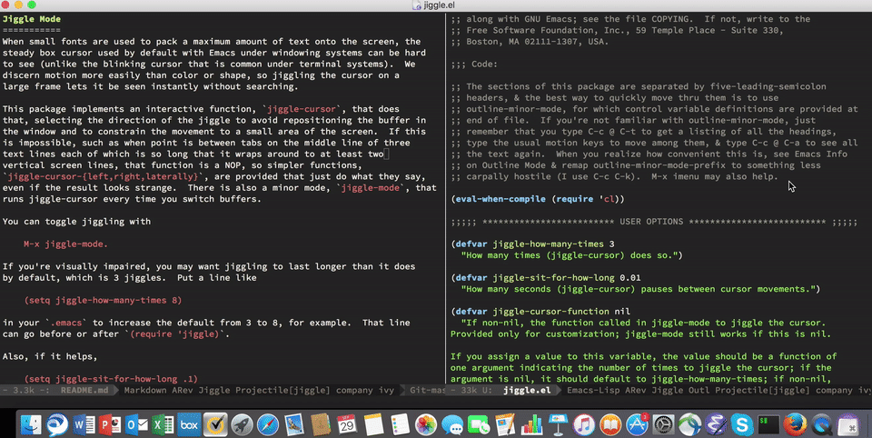

Jiggle Mode
===========
When small fonts are used to pack a maximum amount of text onto the screen, the
steady box cursor used by default with Emacs under windowing systems can be hard
to see (unlike the blinking cursor that is common under terminal systems).  We
discern motion more easily than color or shape, so jiggling the cursor on a
large frame lets it be seen instantly without searching. Please
see [the screencast below](#Screencast).

This package implements an interactive function, `jiggle-cursor`, that does
that, selecting the direction of the jiggle to avoid repositioning the buffer in
the window and to constrain the movement to a small area of the screen.  If this
is impossible, such as when point is between tabs on the middle line of three
text lines each of which is so long that it wraps around to at least two
vertical screen lines, that function is a NOP, so simpler functions,
`jiggle-cursor-{left,right,laterally}`, are provided that just do what they say,
even if the result looks strange.  There is also a minor mode, `jiggle-mode`, that
runs jiggle-cursor every time you switch buffers.

You can toggle jiggling with

    M-x jiggle-mode.

If you're visually impaired, you may want jiggling to last longer than it does
by default, which is 3 jiggles.  Put a line like

    (setq jiggle-how-many-times 8)

in your `.emacs` to increase the default from 3 to 8, for example.  That line
can go before or after `(require 'jiggle)`.

Also, if it helps,

    (setq jiggle-sit-for-how-long .1)

slows down the jiggling by a factor of 10 (the default is .01), theoretically,
although in real life contemporary computers aren't that fast or precise, so the
effect will be smaller.

Screencast
----------
Below you can see the jiggle-mode in action.

Installation
------------

### Manual Installation
You can use this package either interactively or from your `.emacs` file.  In
either case, first you'll need to copy this file to a directory that appears in
your load-path. `load-path` is the name of a variable that contains a list of
directories Emacs searches for files to load.  To prepend another directory to
load-path, put a line like `(add-to-list 'load-path "c:/My_Directory")` in your
`.emacs` file.

Then, put the line

    (require 'jiggle)

in your .emacs file.  Then, if you want the cursor jiggled automatically every
time you switch buffers, put the line

    (jiggle-mode t)

### Using the Package Manager

If you have `melpa` installed, simply type:

    M-x package-install jiggle

Add following lines to your init file:

    (require 'jiggle)

Then turn on the `jiggle-mode`:

    M-x jiggle-mode

Copyright
---------
Copyright (C) 1998 Will Mengarini

Author: Will Mengarini seldon@eskimo.com
URL: http://www.eskimo.com/~seldon

This program is free software; you can redistribute it and/or modify it under
the terms of the GNU General Public License as published by the Free Software
Foundation; either version 2, or (at your option) any later version.

This program is distributed in the hope that it will be useful, but WITHOUT ANY
WARRANTY; without even the implied warranty of MERCHANTABILITY or FITNESS FOR A
PARTICULAR PURPOSE.  See the GNU General Public License for more details.

You should have received a copy of the GNU General Public License along with GNU
Emacs; see the file COPYING.  If not, write to the Free Software Foundation,
Inc., 59 Temple Place - Suite 330, Boston, MA 02111-1307, USA.
